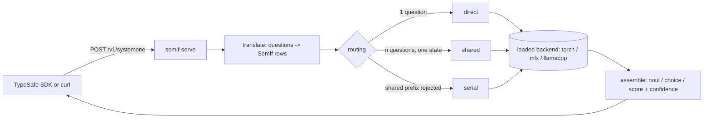

# Jev-compatible API layer (`semif-serve`)

> **Status: implemented except section 5.2 phase 2.** `src/semif_api/` serves
> Noul, Score, and Choice up to 16 options. Operator guide: [Serving](SERVE.md).

SemIf scores one decision at a time from a JSONL file. TypeSafe's Jev is consumed
over an HTTP endpoint with a different request shape, three question primitives,
and official Python/JavaScript SDKs. This document specifies `semif-serve`: a
local HTTP server that speaks Jev's wire contract and answers from a SemIf
backend, so that an application written against the TypeSafe SDKs runs against a
local open model by changing one environment variable.

```bash
export TYPESAFE_BASE_URL=http://127.0.0.1:8471
```

## 1. Scope

**In scope**

- `POST /v1/systemone` and `GET /v1/models`, byte-compatible with the
  [TypeSafe HTTP API](https://docs.typesafe.ai/api.md) as published on 2026-09-22.
- The three primitives — Noul, Choice, Score — mapped onto SemIf's single
  categorical readout.
- Round-trip compatibility with `typesafe_sdk` (Python) and `@typesafe-ai/sdk`
  (JavaScript) at their current versions, without patching either SDK.
- Reuse of the existing `torch`, `mlx`, and `llamacpp` backends and of the frozen
  `direct-options-v1` prompt, unchanged, for every request that fits it.

**Out of scope**

- Reproducing Jev's weights, training, or accuracy. Agreement between the pinned
  4B baseline and published Jev on the aligned 102-row subset is 0.845 vs 0.883
  (see [Results](RESULTS.md)); the API layer changes the interface, not the model.
- Rate limiting, billing, multi-tenancy, TLS termination, or authentication
  beyond a single shared local token.
- The `reranker` mode, which has no Jev-side equivalent.
- Streaming. Jev does not stream and neither does this.

**Non-goal, stated explicitly:** this layer must never make SemIf's outputs look
more calibrated than they are. `confidence` is a distribution statistic, and every
answer carries a `semif` block recording the readout, prompt hash, model revision,
and calibration temperature actually applied.

## 2. Architecture



One server process owns exactly one loaded backend and one model, matching the
existing constraint that one loaded backend owns one stateful scoring context.
Requests are serialized through a single worker; concurrency is a queue in front
of the model, not parallel model access.

## 3. Wire contract

### 3.1 Endpoints

| Method | Path             | Purpose                                     |
| ------ | ---------------- | ------------------------------------------- |
| `POST` | `/v1/systemone`  | Evaluate one state against typed questions. |
| `GET`  | `/v1/models`     | List model names accepted in `model`.       |
| `GET`  | `/healthz`       | SemIf extension. Liveness plus loaded-model provenance. |

`/healthz` is not part of Jev's surface and is namespaced outside `/v1` so it can
never be mistaken for one.

### 3.2 Authentication

Jev requires `Authorization: Bearer <API_KEY>`.

- If `SEMIF_API_KEY` is unset, the server accepts any `Authorization` header and
  a missing one. This is the local-development default and the server logs a
  one-line warning at startup.
- If `SEMIF_API_KEY` is set, the header must be `Bearer <that value>` exactly.
  Anything else returns `401`.

The SDKs require *some* key to be present before they will send a request, so
local users still set `TYPESAFE_API_KEY` to any placeholder.

### 3.3 Response headers

| Header                  | Value                                                        |
| ----------------------- | ------------------------------------------------------------ |
| `content-type`          | `application/json`                                            |
| `x-typesafe-request-id` | A UUIDv4 per request. `typesafe_sdk` surfaces this as `request_id`, and the SDK's exception types read it from this exact header name. |
| `x-semif-backend`       | `torch` \| `mlx` \| `llamacpp`                                |
| `x-semif-mode`          | `direct` \| `serial` \| `shared`                              |
| `retry-after`           | Only on `503`. Seconds, integer.                              |

## 4. Request translation

### 4.1 Top-level request

```json
{
  "state": "string | object | array",
  "model": "string",
  "questions": { "<id>": { "type": "...", "instructions": ..., "criteria": ... } }
}
```

| Field       | Jev rule                         | `semif-serve` rule |
| ----------- | -------------------------------- | ------------------ |
| `state`     | required, string/object/array    | Passed through unmodified into every row's `state`. Must satisfy `core.validate_row`: nonempty, finite, JSON-serializable. |
| `model`     | required                         | See §4.2. |
| `questions` | required, map, ≥1 entry          | Each entry becomes one SemIf row whose `id` is the question key. Keys must be unique (guaranteed by JSON object semantics) and nonempty. |

Question keys are the SemIf row `id`s. `core.validate_row` already requires a
nonempty string id, and `shared.score_shared` already requires unique ids, so the
mapping is direct. Like Jev, the key is never sent to the model: it does not
appear anywhere in `direct_messages`.

**State is not re-serialized.** `shared._state_prefix` locates the evidence
payload by exact substring match against `json.dumps({"evidence": state})`. The
server must therefore hold the parsed JSON value and hand the same Python object
to every row. Any normalization pass — key sorting, whitespace, number
re-formatting — would break prefix detection and silently drop the request to
serial mode. Do not add one.

### 4.2 Model names

`GET /v1/models` returns the real local identity. `POST` additionally accepts Jev
alias names so unmodified sample code runs.

| Accepted in `model`                        | Behavior |
| ------------------------------------------ | -------- |
| The loaded model's SemIf id (see below)     | Served.  |
| `semif-latest`                              | Alias for the loaded model. |
| `jev-latest`, `jev-preview`, `jev-1.13.0`   | Served by the loaded SemIf model, **only** when `SEMIF_ACCEPT_JEV_ALIASES=1` (default `1`). Set to `0` to reject them with `422`. |
| Anything else                               | `422`, `unknown_model`. |

The SemIf model id is `semif/<source>@<revision12>[+<transform>]`, for example
`semif/Qwen3.5-4B@851bf6e806ef+mlx-bf16` or `...+mlx-q4`. The response's `model`
field **always** reports this id, never `jev-*`, even when a Jev alias was sent.
Jev's own contract is that `model` reports the version that actually answered;
honoring that is what keeps the alias acceptance honest, and it means application
logs record which open model produced each result.

`GET /v1/models` returns one entry, shaped as Jev's `ModelMetadata`:

```json
{"models": [{
  "name": "semif/Qwen3.5-4B@851bf6e806ef+mlx-bf16",
  "description": "SemIf direct option readout. Open baseline; not Jev.",
  "release_date": "2026-09-22"
}]}
```

### 4.3 `instructions` → `question`

Jev accepts `string | object | array`. SemIf requires a nonempty string.

- **string** → used verbatim.
- **object / array** → `json.dumps(value, ensure_ascii=False, allow_nan=False)`
  with default separators and **insertion order preserved**. Field order in
  structured instructions is semantic (the documented pattern puts data in named
  fields and refers to them from a `question` field), so sorting keys is
  forbidden.
- Empty string, empty object, empty array, `null` → `422`.

The resulting string lands in `direct_messages`'s `criterion` field. This is a
lossless transport of the structure into the prompt; it is not the same rendering
Jev uses, and the layer does not claim it is.

### 4.4 Primitive mapping

All three primitives compile to the same SemIf row: a `question` plus an ordered
list of `{id, description}` options read out of one forward pass.

#### Noul

```json
{"type": "noul", "instructions": "Does this convey urgency?",
 "criteria": {"true": "Explicitly time-sensitive", "false": "No urgency expressed"}}
```

| SemIf row field | Value |
| --------------- | ----- |
| `question`      | Rendered `instructions` (§4.3). |
| `options[0]`    | `{"id": "true", "description": <criteria.true, rendered>}` |
| `options[1]`    | `{"id": "false", "description": <criteria.false, rendered>}` |

`criteria` is optional for Noul. Defaults when absent or when one side is
omitted: `"The answer to the question is yes."` and `"The answer to the question
is no."` Defaults are frozen constants — changing them changes every Noul
`prompt_sha256` and is a prompt-version change (§9).

Option order is fixed as `true` then `false`, so the yes side always occupies
slot `A`. Answer: `noul = probabilities["true"]`.

Structured (`object`/`array`) criteria values are rendered per §4.3.

#### Choice

```json
{"type": "choice", "instructions": "Which team should handle this?",
 "criteria": {"billing": "Payments, invoicing, refunds", "technical": null}}
```

| SemIf row field | Value |
| --------------- | ----- |
| `question`      | Rendered `instructions`. |
| `options[i]`    | `{"id": <key>, "description": <value>}` in **JSON insertion order**. |

A `null` description means "this option needs no extra detail". SemIf's
`validate_row` requires a string description, so `null` becomes the option key
itself. That is the minimal faithful rendering: the model still sees the option
name, which is what the key carries. Empty-string descriptions are also replaced
by the key.

Duplicate keys cannot occur. Option count limits are §5.

Answer: `choice = argmax`, `probabilities = {option_id: p}`, `confidence` per §6.3.

#### Score

```json
{"type": "score", "instructions": "How frustrated is the customer?",
 "criteria": ["Calm", "Frustrated", "Very angry"]}
```

| SemIf row field | Value |
| --------------- | ----- |
| `question`      | Rendered `instructions`. |
| `options[i]`    | `{"id": str(i), "description": <level i, rendered>}` in array order. |

Levels are 0-indexed and ordered low to high, matching Jev's `legend` keys.
Because SemIf option ids become the JSON keys of `probabilities`, using `"0"`,
`"1"`, … produces Jev's exact `probabilities` shape with no post-processing.

Answer:

- `score = Σ i · p_i` — the probability-weighted position, which can land
  between levels, as Jev's does.
- `legend = {str(i): description_i}` — the **original** level text, not the
  rendered JSON, when a level was supplied as a plain string. When a level was
  supplied as an object or array, `legend` carries the rendered JSON string,
  because Jev types `legend` as `map<string, string>`.
- `probabilities = {str(i): p_i}`.
- `confidence` per §6.3.

The ordinal meaning of a Score is carried entirely by the level descriptions and
by their order in the prompt. SemIf's slots are nominal letters; nothing in the
readout tells the model that `B` sits between `A` and `C`. Score is therefore the
primitive most likely to diverge from Jev, and §12 makes that a required
measurement rather than a footnote.

## 5. Answer slots and the option ceiling

SemIf reads option probabilities from single-token uppercase-letter slots. The
current alphabet is `LETTERS = "ABCDEFGHIJKLMNOP"` — 16 options — and
`direct._slot_ids` enforces that every slot is one exact round-trip token and
that appending it does not change the prompt's tokenization.

Jev accepts up to 255 Choice options and up to 10 Score levels.

| Primitive | Jev limit | SemIf `direct-options-v1` | Gap |
| --------- | --------- | ------------------------- | --- |
| Noul      | 2 (fixed) | 2                         | none |
| Score     | 2–10      | 16                        | none |
| Choice    | 2–255     | 2–16                      | **17–255 unsupported** |

### 5.1 Measured slot capacity

Against the pinned tokenizer (`Qwen/Qwen3.5-4B` @ `851bf6e8`):

| Candidate slot set          | Single-token, exact round-trip |
| --------------------------- | -----------------------------: |
| `A`–`Z`                     | 26 of 26 |
| `0`–`9`                     | 10 of 10 |
| `AA`–`ZZ` (two uppercase)   | 562 of 676 |

So a flat 255-option readout is reachable without changing the readout
mechanism — it needs a larger slot alphabet, not a different algorithm.

### 5.2 Specified behavior

**Phase 1 (required).** Options 2–16 use `direct-options-v1` unchanged. The
prompt, the slot letters, and therefore `prompt_sha256` are bit-identical to what
the committed evidence was produced with. A Choice with 17–255 options returns
`422` with `code: "option_count_unsupported"` and a body naming the limit. This is
a real, documented divergence from Jev, not a silent truncation.

**Phase 2 (separate change, separate evidence).** A `direct-options-v2` prompt
version introduces a frozen slot table:

1. Slots 1–26: `A`–`Z`.
2. Slots 27–255: two-letter codes drawn from `AA`–`ZZ` in lexicographic order,
   skipping any pair that is not a single exact round-trip token, until 255 slots
   exist.

The table is committed as data, not regenerated at runtime, and `_slot_ids`'
per-slot round-trip and boundary assertions still run against the loaded
tokenizer at request time. Mixing one- and two-character slots changes the prompt
for **every** row, including small ones, so v2 is opt-in
(`SEMIF_PROMPT_VERSION=direct-options-v2`) and must not become the default until
the authored-decisions and perturbation workloads have been re-run under it and
the results committed. Until that evidence exists, v2 is unbenchmarked and the
docs must say so.

Phase 2 also inherits an untested question: slot-position prior. With 16 options
the letters are a compact, common sequence; with 255 mixed-width codes they are
not. §12 requires an order-permutation check before v2 is recommended.

## 6. Answer construction

### 6.1 Probabilities

SemIf returns `probabilities` as a list aligned to `option_ids`, produced by
`core.softmax` over the selected logits. The server zips them into the map Jev
returns. No renormalization is applied: the softmax already sums to 1 over
exactly the declared options.

Values are emitted as JSON floats. `typesafe_sdk`'s response models are
`ConfigDict(strict=True)`, so an integer-valued probability serialized as `0`
rather than `0.0` fails SDK validation. The serializer must guarantee a decimal
point on every probability, `noul`, `score`, and `confidence` value.

Score `legend` and `probabilities` keys go on the wire as JSON strings, as the
API reference specifies. `typesafe_sdk` declares them as integer-keyed mappings
and relies on pydantic's JSON mode to coerce, so `ScoreAnswer.legend[0]` is the
correct SDK-side access and `legend["0"]` is the correct wire-side one. A
consequence worth knowing when writing conformance checks: validating a response
with `model_validate` on an already-parsed `dict` fails, while
`model_validate_json` on the raw bytes succeeds. The same applies to
`ListModelsResponse.models`, which the SDK types as a tuple.

### 6.2 Temperature

If a calibration temperature `T` is configured (§8), it is applied to the logits
before softmax: `softmax(logits / T)`. `T = 1.0` is the default and is a no-op.
`T` never changes `choice` (temperature scaling preserves argmax) and never
changes a Score's level ordering, but it does change `score`, since `score` is a
probability-weighted mean. Both the applied `T` and its provenance are recorded
in the `semif` extension block.

### 6.3 Confidence

Jev returns `confidence` on Choice and Score answers, never on Noul. The
published definition is that it collapses the distribution's shape into `[0, 1]`,
with the docs giving this formula for `n` options:

```
confidence = clamp((n · max(p) − 1) / (n − 1), 0, 1)
```

`semif-serve` uses exactly this. Two properties matter and both hold: an even
split over `n` options gives `0.0`, and all mass on one option gives `1.0`.

**The published examples do not reproduce digit for digit.** Applying the formula
to the probabilities printed in the API reference gives 0.82 where the Choice
example shows `confidence: 0.81`, and 0.925 where the Score example shows 0.92.
Both are explained by two-decimal display rounding, but only inside a narrow
band: a true peak near 0.8755 displays as 0.88 and yields 0.81, and one near
0.9455 displays as 0.95 and yields 0.92. Those bands exist, so the formula is
consistent with both examples — it is not confirmed by them. `tests/test_api_assemble.py`
asserts the bands are non-empty rather than asserting the printed digits.

The TypeSafe docs present this as the calculation used by their interactive
explainer and describe `confidence` as "a statistic computed from the probability
distribution" without publishing the server-side formula verbatim. Jev's
production statistic may differ. The layer therefore reports
`semif.confidence_formula: "normalized-peak-v1"` on every Choice and Score answer
so a consumer that has tuned thresholds against real Jev can tell which statistic
produced a number. Full `probabilities` are always returned, so any consumer can
compute its own.

Noul answers carry no `confidence` field. Emitting one would be a wire
incompatibility, since the SDK's `NoulAnswer` has no such attribute.

### 6.4 Answer objects

| Type   | Fields returned |
| ------ | --------------- |
| noul   | `type`, `noul` |
| choice | `type`, `choice`, `probabilities`, `confidence` |
| score  | `type`, `score`, `legend`, `probabilities`, `confidence` |

Plus `semif` (§10) on all three. Answers are keyed by the original question ids
and every question in the request gets exactly one answer.

## 7. Execution routing

The server picks a SemIf mode from the request shape. The choice is an
optimization and must not change what the model is asked.

| Condition | Mode | Why |
| --------- | ---- | --- |
| Exactly 1 question | `direct` | No prefix to amortize. |
| ≥2 questions | `shared` | All questions share one state by construction — exactly `score_shared`'s precondition. |
| `shared` raises on prefix validation | `serial` | `_state_prefix` can reject a state whose serialization does not appear verbatim in the chat template. |
| `serial` also raises | `direct` per row | Always-correct fallback. |

Fallbacks are logged and reported in `semif.mode`. They are correctness-preserving
in interface but not bit-identical in output: the repository already documents
that BF16 execution changed 5–6 of 777 argmaxes between fresh and reuse paths, and
that the llama.cpp direct and prefix-cached paths differ numerically. A client
that needs one fixed execution path sets `SEMIF_MODE` to pin it; pinning `direct`
with many questions is slower and correct.

Every row in one request is scored in one model interaction. Partial failure is
not possible: if any row fails validation the whole request is rejected before the
model is touched.

## 8. Configuration

| Variable | Default | Meaning |
| -------- | ------- | ------- |
| `SEMIF_BACKEND` | `torch` | `torch`, `mlx`, or `llamacpp`. |
| `SEMIF_MODEL` | — (required) | HF repo id or local directory. |
| `SEMIF_REVISION` | — (required) | 40-char commit id, or a manifest label for local dirs. Same rule the loaders already enforce. |
| `SEMIF_DEVICE` | `auto` | Torch only: `auto`, `cuda`, `mps`. |
| `SEMIF_DTYPE` | `bfloat16` | Torch only. |
| `SEMIF_MLX_BITS` | unset | `4` or `8`; MLX in-memory quantization. |
| `SEMIF_MLX_CACHE_LIMIT_MIB` | `256` | MLX allocator cache bound. |
| `SEMIF_GGUF` | — | Required for `llamacpp`. |
| `SEMIF_LLAMA_THREADS` | all cores | llama.cpp only. |
| `SEMIF_MAX_INPUT_TOKENS` | `4096` | Per-question prompt budget. Enforced, never truncated. |
| `SEMIF_MODE` | `auto` | Pin `direct`/`serial`/`shared`. |
| `SEMIF_PROMPT_VERSION` | `direct-options-v1` | §5.2. |
| `SEMIF_TEMPERATURE` | `1.0` | Global calibration temperature, or a path to a JSON map of per-question-type temperatures. |
| `SEMIF_API_KEY` | unset | §3.2. |
| `SEMIF_ACCEPT_JEV_ALIASES` | `1` | §4.2. |
| `SEMIF_HOST` / `SEMIF_PORT` | `127.0.0.1` / `8471` | Binds loopback by default. |

Every flag has a matching `semif-serve` CLI option; the CLI wins over the
environment. The server refuses to bind a non-loopback address unless
`SEMIF_API_KEY` is set.

Temperatures come from [Calibration](CALIBRATION.md): the fitted values there are
1.23 (authored decisions), 2.50 (WANLI), and 1.71 (Every judgments). Those are
per-workload, fitted on labeled data, and are **not** defaults. Shipping one of
them as a global default would apply a workload-specific correction to unrelated
traffic, so the default stays 1.0 and the docs point at the fitting procedure.

## 9. Determinism and provenance

These are invariants, not aspirations. Each is a test in §12.

1. **Frozen prompt.** For a request that maps to ≤16 options, the resulting
   `prompt_sha256` equals the hash produced by the existing CLI for the
   equivalent JSONL row. The API layer is a translation, and this is how that is
   proven rather than asserted.
2. **No truncation.** An over-budget question is rejected, matching the existing
   `encode_prompt` contract and the EXL3 bridge's stated rule.
3. **Pinned revision.** The loaders' existing requirement of a 40-character
   revision for remote models is not relaxed for the server.
4. **Reported identity is real.** `model` in the response is the SemIf id of the
   weights that answered, including quantization transforms.
5. **Stable ordering.** Option order in the prompt follows the request's JSON
   order. Two requests with the same questions in the same order produce the same
   prompt hash; reordering `criteria` keys is a different prompt and may produce a
   different answer.

Any change to the default rendering rules in §4 is a `prompt_version` bump with
re-run evidence, under the same rule the repository already applies to headline
claims.

## 10. SemIf extension block

`typesafe_sdk`'s response models use `extra="ignore"`, and the JavaScript SDK's
interfaces are structural, so additional fields are safe for both SDKs and
invisible to code that does not look for them. Direct HTTP consumers see them.

Per answer:

```json
"semif": {
  "option_logits": [28.0, 19.125, 19.625],
  "option_ids": ["yes", "no", "insufficient"],
  "prompt_sha256": "7ac3...",
  "prompt_version": "direct-options-v1",
  "input_tokens": 142,
  "temperature": 1.0,
  "confidence_formula": "normalized-peak-v1",
  "readout": "native full-vocabulary last-position logits restricted to declared answer slots",
  "probability_status": "conditional option score; uncalibrated as decision confidence"
}
```

Top level:

```json
"semif": {
  "mode": "shared",
  "backend": "mlx",
  "model": {"source": "Qwen/Qwen3.5-4B", "revision": "851bf6e8...", "...": "backend metadata verbatim"},
  "timing": {"total_seconds": 0.41, "prefix_tokens": 118, "...": "mode-specific"},
  "fallback_from": null
}
```

The `probability_status` and `readout` strings are carried through from the
existing result dictionaries verbatim. They are the repository's own statement of
what these numbers are, and the API layer does not get to soften it.

## 11. Usage and errors

### 11.1 Usage

Jev returns `usage.input_tokens` and `usage.output_tokens`, both required
integers.

- `input_tokens`: the tokens actually evaluated. For `direct`/`serial`, the sum of
  each row's prompt length. For `shared`, `prefix_tokens + Σ suffix_tokens`, which
  counts the shared state once — the honest count for a single prefill. The
  per-question prompt lengths are in each answer's `semif.input_tokens`, so a
  consumer that wants the un-amortized sum can compute it.
- `output_tokens`: always `0`. SemIf generates no answer token. Jev reports a
  small non-zero number here; reporting a fabricated one to match would be a lie
  about the mechanism, and the whole point of the readout is that the number is
  zero.

### 11.2 Errors

| Status | When |
| ------ | ---- |
| `401` | `SEMIF_API_KEY` set and the bearer token does not match. |
| `404` | Unknown path. |
| `422` | Body failed validation: missing `state`/`model`/`questions`, unknown question `type`, unknown model, empty instructions, Choice with <2 or >16 options, Score with <2 or >16 levels, duplicate option ids, non-JSON-serializable state, prompt over `SEMIF_MAX_INPUT_TOKENS`. |
| `500` | Backend raised. Body carries the exception type and message; no traceback. |
| `503` | Model still loading, or the single worker queue is saturated. Sets `retry-after`. |

TypeSafe does not publish the JSON schema of its error bodies, so this one is
SemIf's own and is documented as such:

```json
{"error": {
  "type": "invalid_request_error",
  "code": "option_count_unsupported",
  "message": "Question 'department' has 42 options; direct-options-v1 supports 2-16.",
  "param": "questions.department.criteria"
}}
```

`typesafe_sdk` raises `TypeSafeUnprocessableEntityError` on 422 and
`TypeSafeAuthenticationError` on 401 and exposes this body as `.body`, so SDK
users get typed exceptions without any SDK change. `429` and `529` are never
emitted: there is no rate limit and no shared capacity. A client's retry policy is
simply never triggered by them.

## 12. Test plan

**Translation, no model required.** These run in CI alongside the existing suite.

- Golden request → SemIf row fixtures for every primitive, including structured
  instructions, structured criteria, `null` and empty-string Choice descriptions,
  and absent Noul criteria.
- Hash equality: for each fixture, the row produced by the server and the same row
  written as JSONL produce the same `prompt_sha256` under a stub tokenizer.
- Confidence: even split → 0.0; one-hot → 1.0; and for each published example, a
  true peak exists that is consistent with both its printed probability and its
  printed confidence under two-decimal rounding (§6.3).
- Score: `Σ i·p_i` against the docs' example (`{0: 0.0, 1: 0.95, 2: 0.05}` → 1.05).
- Every 422 case, asserting status, `code`, and `param`.
- JSON serialization: no probability, `noul`, `score`, or `confidence` value
  serializes without a decimal point.
- Slot table: every entry of the phase-2 table is a single exact round-trip token
  for the pinned tokenizer, and the table has exactly 255 entries.

**Wire conformance.** Response bodies validate against a committed JSON Schema
derived from the published API reference, and against `typesafe_sdk`'s own
response models imported directly, so a future SDK release that tightens
validation fails the suite rather than a user's application.

**Live SDK round-trip.** Two levels, because they catch different things.
`tests/test_api_conformance.py` drives the real `AsyncTypeSafeClient` against the
app over an in-process ASGI transport with a stub backend, so the SDK contract is
checked on every run with no weights and no network.
`tests/test_api_live.py` repeats the three primitives against real weights and is
skipped unless `SEMIF_LIVE_MODEL` is set.

**Equivalence to the CLI.** Two levels again. Without weights, the rows the
server builds and the equivalent JSONL rows must produce identical
`direct_messages` output, which makes their prompt hashes equal under any
tokenizer. With weights, `tests/test_api_live.py` asserts the server's
`prompt_sha256` and probabilities match a direct scorer call on the same
decision. A full authored-decisions fixture comparison belongs in `results/`
as committed evidence, not as a claim in the README.

**Score ordinality (required before Score is documented as usable).** On a
labeled ordered workload, measure whether reversing level order reverses the
score symmetrically, and report the asymmetry. §4.4 flags this as the most likely
divergence; this test is how the divergence gets a number.

**Option-order sensitivity (required before phase 2).** Permute Choice option
order on the authored fixture and report the argmax change rate for 16-option and
for >16-option requests. A large gap between them means the v2 slot alphabet
carries a position prior and v2 stays opt-in.

## 13. Implementation plan

New package, no changes to `semif_phase1`'s scoring modules:

```
src/semif_api/
  __init__.py
  app.py          # routes, auth, headers, error mapping
  translate.py    # §4: request -> rows; pure, no model, no I/O
  assemble.py     # §6: rows -> answers; pure
  slots.py        # §5: frozen slot tables, capacity checks
  runtime.py      # §7: backend ownership, mode routing, fallbacks
  errors.py       # §11.2
  schema/systemone.json
tests/test_api_translate.py
tests/test_api_assemble.py
tests/test_api_runtime.py
tests/test_api_conformance.py
tests/test_api_live.py        # weight-dependent, skipped without SEMIF_LIVE_MODEL
manifests/jev-api-compat.json # machine-readable limits + conformance matrix
```

`translate.py` and `assemble.py` are pure functions over plain dictionaries and
carry the bulk of the tests. `runtime.py` is the only module that imports a
backend.

New optional dependency group, so the default install is unchanged:

```toml
serve = ["fastapi==0.122.0", "uvicorn==0.41.0", "httpx==0.28.1"]
```

Pinned exactly, matching the repository's pinning convention. A stdlib
`http.server` implementation is viable and dependency-free, but FastAPI is worth
the pins for a layer whose entire job is conforming to someone else's contract.
`jsonschema` joins the `test` extra for the response-schema check.

Order of work:

1. ✅ `slots.py`, `translate.py`, `assemble.py` + their tests. No server, no model.
2. ✅ `errors.py`, `app.py`, `runtime.py`.
3. ✅ `shared`/`serial` routing and fallback reporting.
4. ✅ Conformance schema and SDK round-trip tests.
5. ✅ `docs/SERVE.md` (operator guide) and a README quick-start entry.
6. ⬜ CLI-equivalence evidence run over the authored fixture, committed under
   `results/` with checksums per `AGENTS.md`.
7. ⬜ Phase 2 slot alphabet, with its own benchmark run, behind `SEMIF_PROMPT_VERSION`.
8. ⬜ The §12 Score-ordinality and option-order measurements.

Steps 1–5 make the layer usable for Noul, Score, and Choice up to 16 options,
which covers every example in the TypeSafe docs except large-catalog
classification. Steps 6–8 are measurements, and until they exist the
corresponding claims stay out of the README.

## 14. Known divergences from Jev

Stated up front so no one has to discover them:

| # | Divergence | Status |
| - | ---------- | ------ |
| 1 | Choice is capped at 16 options, not 255. | Phase 1 limitation; phase 2 path specified in §5.2. |
| 2 | Context budget defaults to 4096 tokens per question, not 64k/32k. | Configurable; the default matches the committed evidence. |
| 3 | `usage.output_tokens` is always 0. | Mechanism difference, reported truthfully. |
| 4 | `confidence` uses the published normalized-peak formula, which may not be Jev's production statistic. | Labeled in every answer; full probabilities always returned. |
| 5 | Probabilities are uncalibrated by default; Jev is trained for calibrated decisions. | Default `T = 1.0`; per-workload fitting documented in [Calibration](CALIBRATION.md). |
| 6 | Prompt rendering of `instructions` and `criteria` is SemIf's, not Jev's. | Deliberate; SemIf's prompt is frozen and its evidence is tied to it. |
| 7 | Score ordinality is carried only by level text and order. | Measured by the §12 ordinality test before Score is recommended. |
| 8 | Quality is lower. 0.845 vs Jev's 0.883 on the aligned 102-row subset. | This layer changes the interface, not the model. |
| 9 | No rate limiting; `429`/`529` are never returned. | Local single-process server. |

---

*Independent project. Not affiliated with or endorsed by TypeSafe. Jev and
TypeSafe are the property of their respective owners. This layer reproduces a
published interface so that open models can be used in its place; it does not
reproduce Jev's model, training, or results.*
